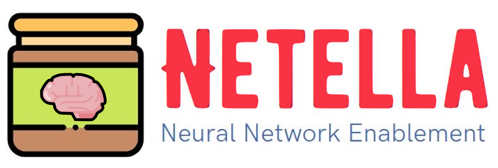

# Neural Network Enablement (AMOS SS 2021)

---

<h3 align="center">
  <a href="https://amosproj.github.io/amos-ss2021-neural-network-enablement/">Documentation</a>
</h3>

---

 

**Industry Partner:** 
Heiko Schick, Huawei Germany

**Project Description:**
The goal of the project is to transfer existing neural networks onto Huawei provided hardware (Atlas 200 DK System) and software and to turn the use of those neural networks into a (web service mediated) service.

    The service shall: 
    ● Allow the upload and display of input and output images
    ● The application of the neural network to the images
    
    The neural networks:
    ● Have to be transferred and configured
    ● Onto dedicated hardware attached to a student workstation

The main function of the neural network allows for colorization of black & white images.

    

Further function: colorize the black & white video.

    

**Project Constraints:**

Core technologies: Python, Python frameworks, and Linux

Needed resources: The Atlas 200DK System 
